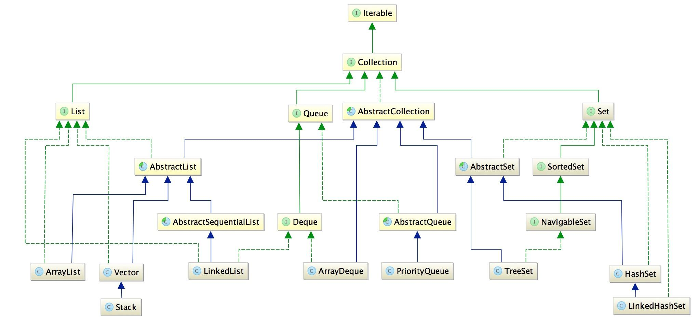

# java之collection总结

**Collection**

# List(链表|线性表)
>接口,可存放重复元素,元素存取是有序的,允许在指定的位置插入元素,并且通过索引访问元素;
>如果我们需要保留存储顺序, 并且保留重复元素, 使用List.

名称   | 特点对比   
---   | ---  
ArrayList|数组线性表 查询较快，增删较慢;非线性安全
LinkedList| 链表结构 查询较慢，增删较快
Vector/Stack| 线性安全,速度慢

# Set(集)
>不可以存放重复元素，元素存取是无序的;
>如果我们不需要保留存储顺序, 并且需要去掉重复元素, 使用Set.

名称   | 特点对比   
---   | ---  
TreeSet|红黑树的数据结构;有序;添加、查询慢
HashSet| 哈希结构;无序;添加、查询快
LikedHashSet |链表+红黑树 ;无序;遍历更快

# Deque(双端队列)
>是Queue的子接口，表示双端队列，即两端（队尾和队首）都能插入和删除的特殊队列；
>特点就是Queue的每种方法都多了一个操作队尾的版本（同时也提供了一个名称上呼应的操作队首的版本（first（队首）、last（队尾）），和Queue的完全相对应（就是Queue的方法多了两个First和Last的后缀而已）

名称   | 特点对比   
---   | ---  
LinkedList|链表结构;
ArrayDeque|双端队列(队列);
PriortyQueue(优先队列)|堆,任意一个节点的值总是不大于（最大堆）或者不小于（最小堆）其父节点的值；堆是一棵完全二叉树 ;
